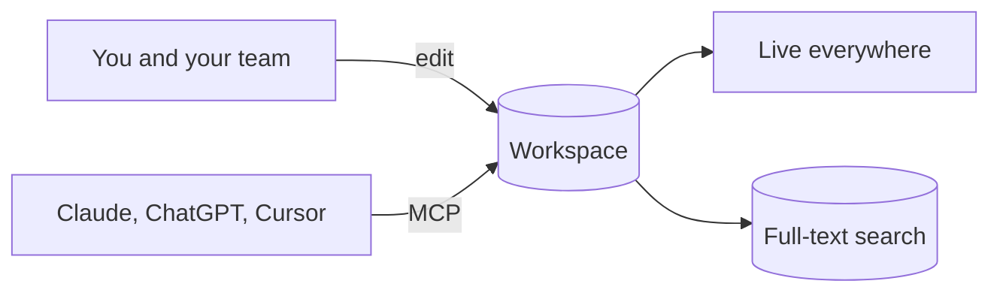

# Overview

Your workspace at a glance. Each block below is one line of markdown (or a code block), so agents can build dashboards like this too.

## Open tasks

::view{show=tasks label="Everywhere"}

## Recently touched

::view{limit=5 label="Latest"}

## Journal

::view{show=month folder=Journal}

## How it fits together

