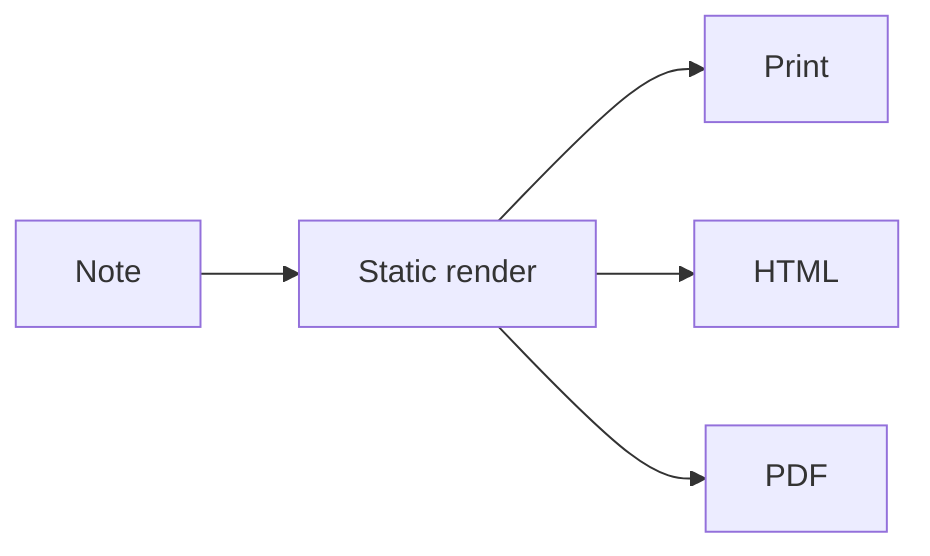

# Export sampler

Everything a note can hold, to print and export: **Share** in the top bar, or ⌘⇧S. It links to [[Export notes]], and its tasks, board, code, math and diagram all come out as they look here.

![[Print badge.svg]]

## Tasks

- [ ] Send the printout to the team due:{{date:+2d}} !high #launch
- [ ] Book the room due:{{date:+5d}} @sam
- [x] Draft the agenda done:{{date:-1d}}

The same tasks, as a widget:

::tasks{note="Export sampler" status=all label="This note"}

## Board

:::kanban
## To do
- [ ] Pick the paper size due:{{date:+3d}}
- [ ] Proofread

## Doing
- [ ] Layout

## Done
- [x] Outline
:::

## Code

```ts title="print.ts"
export async function print(note: Note): Promise<void> {
  const html = await renderStatic(note.path, note.content);
  window.print(); // light theme, page numbers, no app around it
}
```

```diff
- Printing shows the whole app
+ Printing shows just the note
```

## Math

The area of a circle is $A = \pi r^2$, and a sum:

$$
\sum_{k=1}^{n} k = \frac{n(n+1)}{2}
$$

## Diagram



## An embedded note

![[Export notes#Summary]]

## A video

https://www.youtube.com/watch?v=aqz-KE-bpKQ

## A table

| Format | From | Carries |
| --- | --- | --- |
| Markdown | Share → Export as | the file as it is |
| Web page | Share → Export as | one self-contained file |
| PDF | Print → Save as PDF | the printed look |

> A quote, to see how it prints.

## GitHub markdown

> [!TIP]
> Alerts print in their colors. Jump back to [the tasks](#tasks). :printer:

Footnotes gather at the end.[^paper]

> [!WARNING]-
> A collapsed alert: it prints open too.

<details>
<summary>A collapsed section</summary>

This prints open, unless you ask to keep collapsed sections closed.

</details>

[^paper]: As on GitHub, each with a link back to where it was used.
