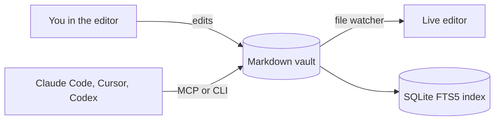

# Overview

Your vault at a glance. Each block below is one line of markdown (or a code block), so agents can build dashboards like this too.

## Open tasks

::tasks{label="Everywhere"}

## Recently touched

::query{limit=5 label="Latest"}

## Journal

::calendar{folder=Journal}

## Writing days

::streak

## How it fits together

